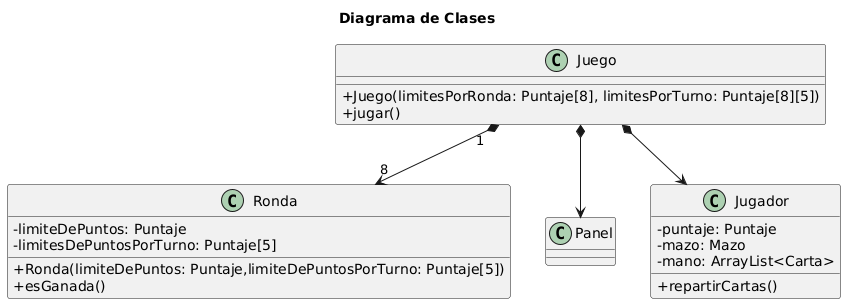
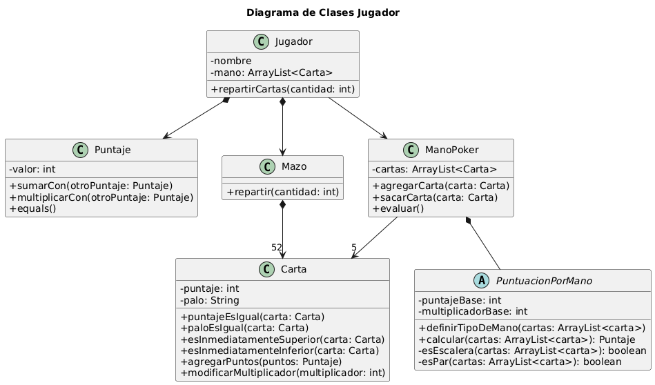

# tp2-paradigmas
Trabajo Práctico 2 de la materia Paradigmas de la Programación

Link al enunciado: https://docs.google.com/document/d/1T9r-2KuevZ3EKaTH36YNftnI6OKW-bP5h50GinJCn-c/edit?tab=t.0

##Diagrama De Clases

